# Big Data Data Science  

Big IoT 

The project provides an introduction to machine learning and big data. All images are either custom by Alpa D Desai or a reference name is included. Most of the images are custom.
For details please go to:https://github.com/alpaddesai/BigDataDataScienceMachineLearning/releases

## Pattern Recognition
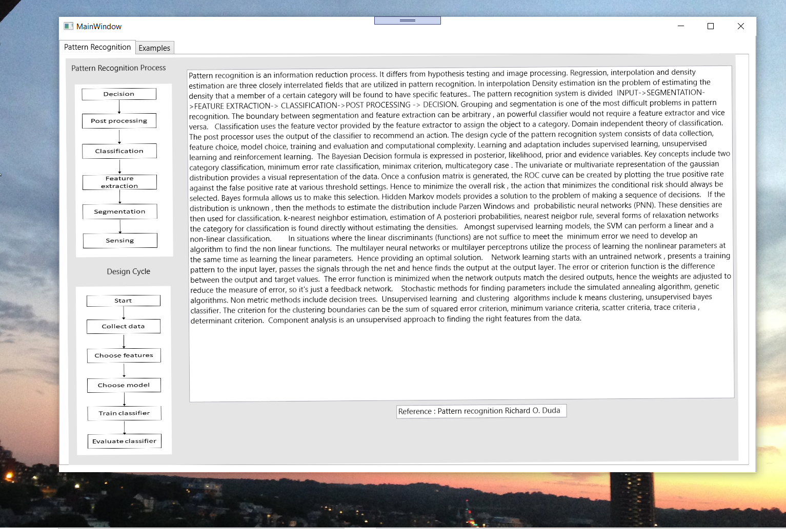

## Classification
#### Images from customized code that is referenced from the example code which is available in the machine learning certificate 
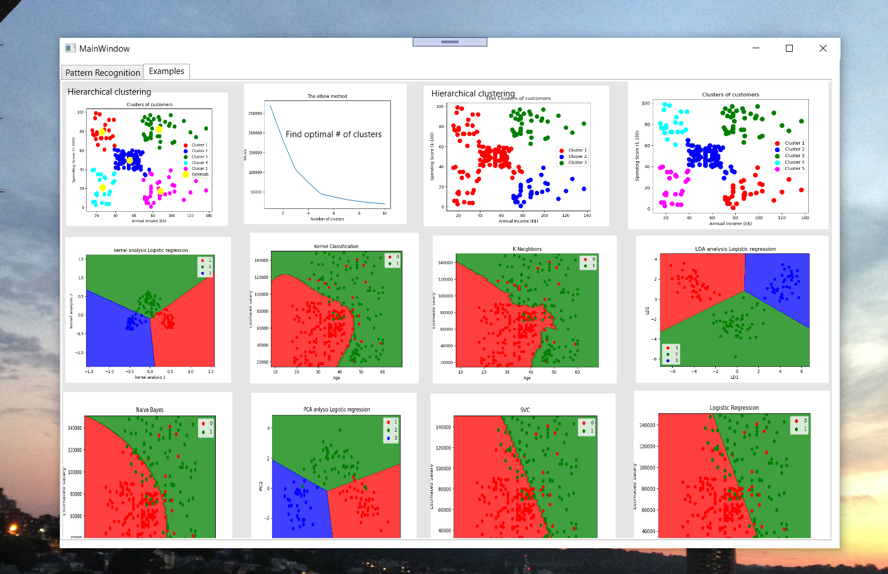

## Numerical Optimization
### MS Excel
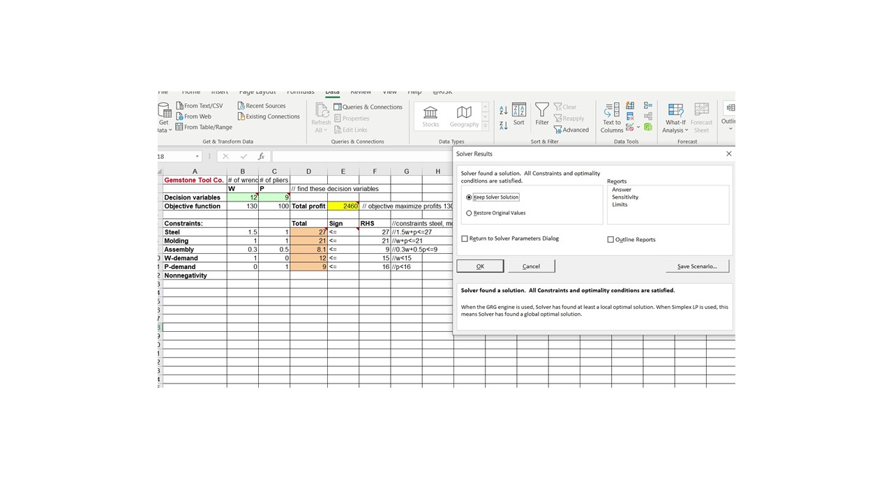

## MultiVariant Analysis
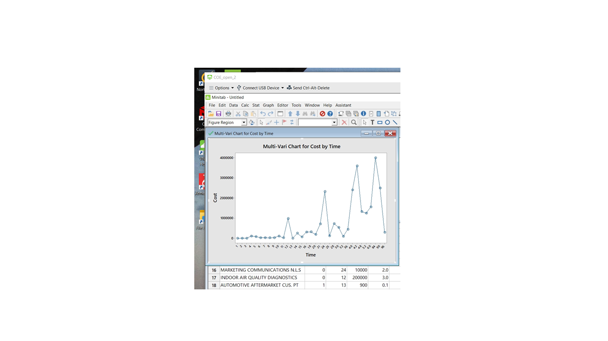

## PDCLA
### Minitab
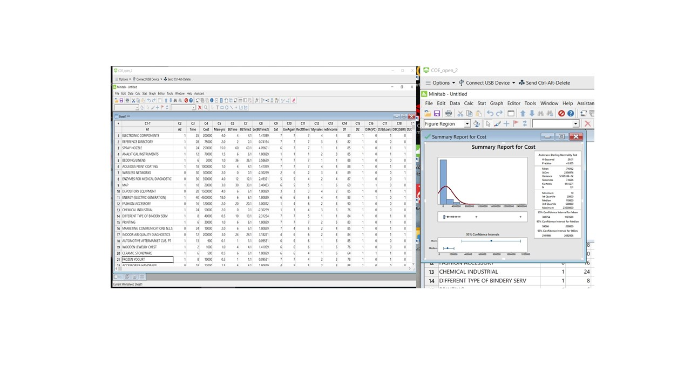

## Machine Learning 
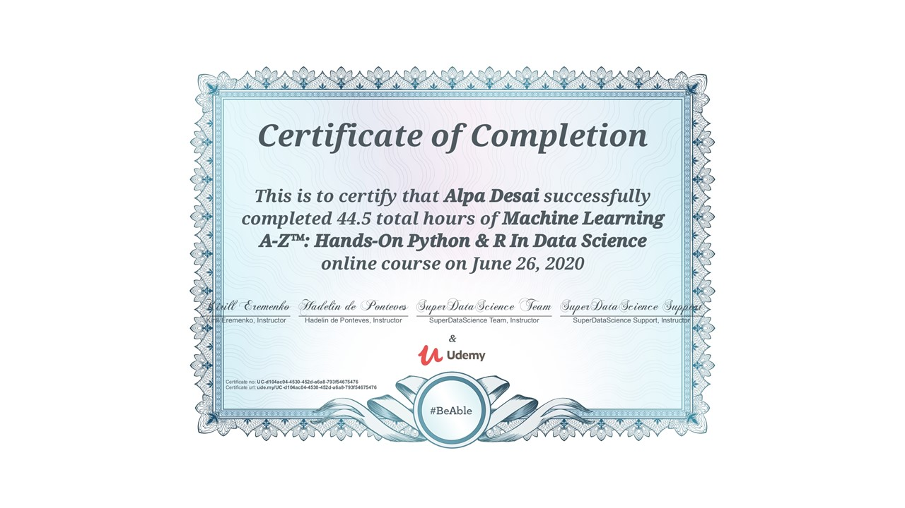

## Python Certificate 
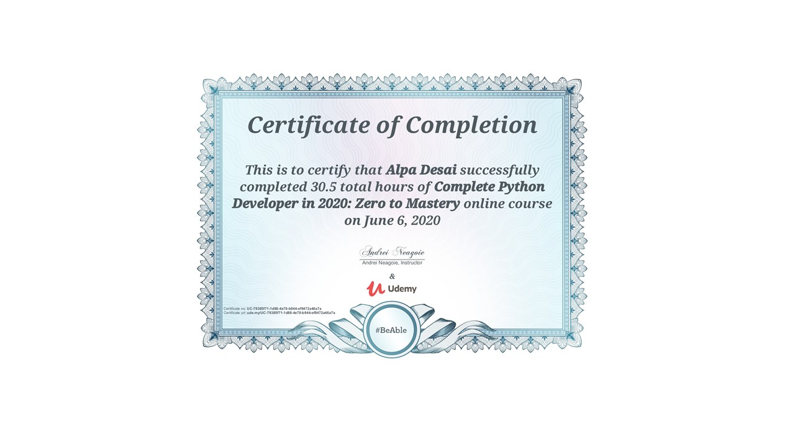
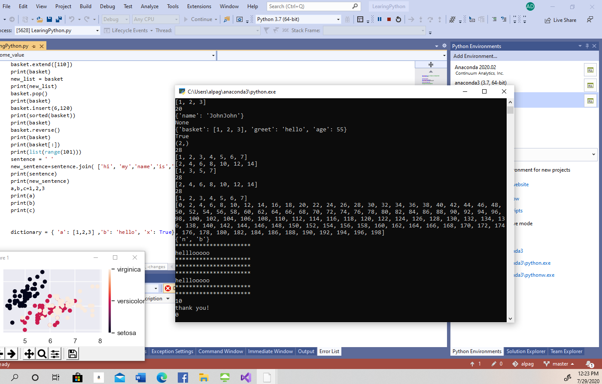
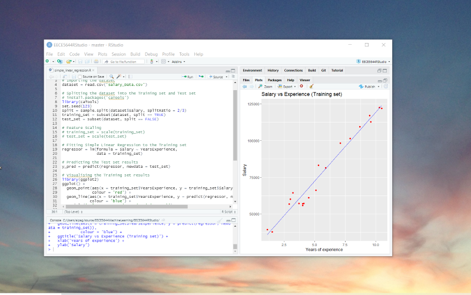

## Machine Learning with Matlab
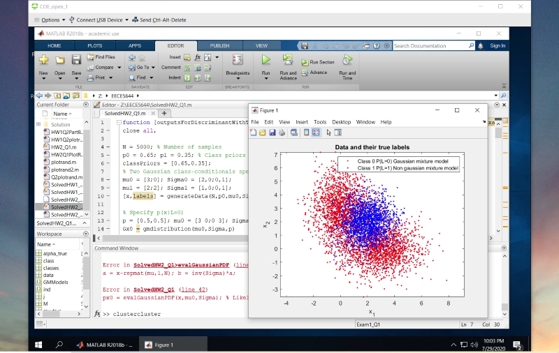

## Applications Probability
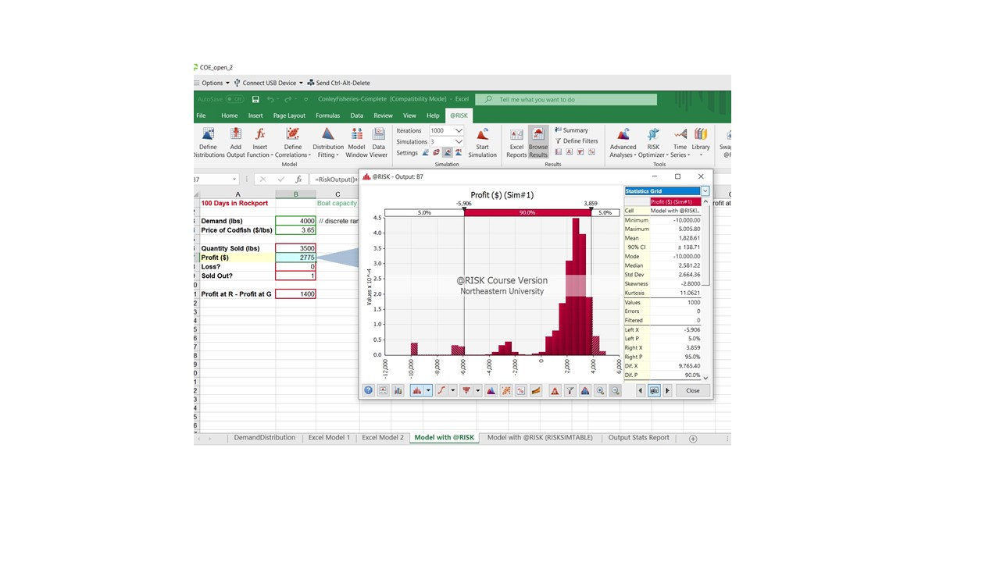

## Matlab
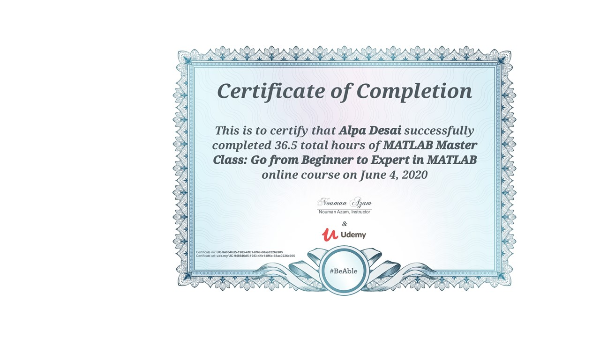

## Exam

## Reference of Image: Images from the code provided in the Matlab certificate
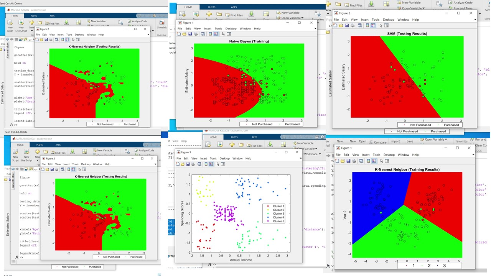

## Certificate

## Ethics

Additional reference : https://github.com/alpaddesai/DataMining and https://github.com/alpaddesai/SoftwareEngineering2022
